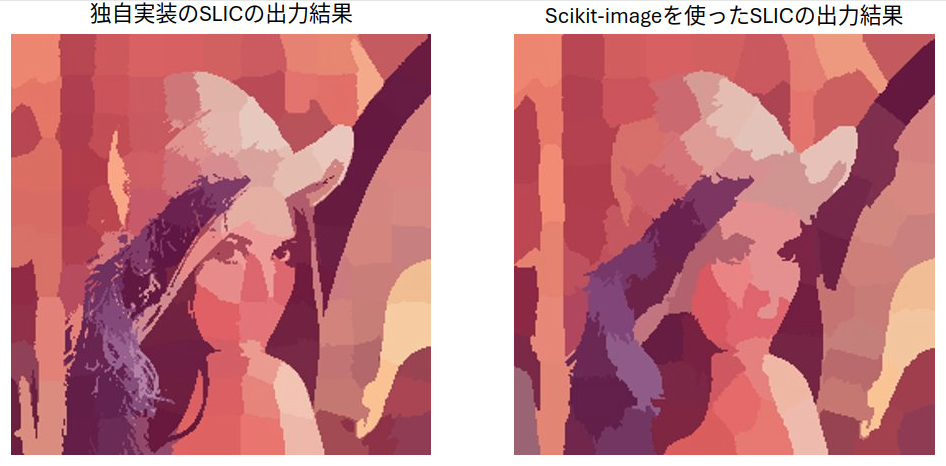

# SLICのアルゴリズム
## 初期化ステップ
 0. RGB表色系からLab表色系二件感
 1. k個のsuperpixelを画像に等間隔に配置
 2. 勾配の情報に基づいて、superpixelの位置を調整する
 3. ピクセルiと最も近いsuperpixelとの距離を∞に初期化しておく
 4. ピクセルiが所属するsuperpixelを未割り当てを表す-1に初期化しておく
 5. クラスタの半径の近似値を求める($ \sqrt{\frac{N}{k}}, N: \text{ピクセル数,} k: \text{superpixelの数} $)

## クラスタリング
 0. あるsuperpixelから特定の範囲に存在するピクセルのみと距離$D$を計算
 1. 各ピクセルのクラスタのインデックスを距離が最も小さいsuperpixelのインデックスに更新する
 2. superpixelの重心を計算し直す
 3. 決められた回数だけ0~2の処理を繰り返す。

## 後処理
 クラスタが未割り当てのピクセルが存在する場合、最も距離が近いsuperpixelのインデックスを割り当てる。

# 独自で実装したSLICの出力結果とscikit-imageに実装されているSLICの出力結果の比較
